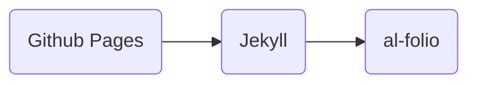

Welcome to my blog, where I post just about computer stuff (mostly). My current interests are on computers, programming, cybersecurity, gaming, and of course teaching.

First of all, why make a blog? I figured that a blog on my website would be the best avenue for me to share my thoughts, opinions, and experiences. Here, I have control of the content and the way I want to present them. But people might wonder: How about Facebook or X? Well, I am privacy-conscious. I have always limited my social media use. When I'm not chatting with my friends on Messenger, I'd be checking Facebook marketplace, and that's it. As a matter of fact, the marketplace would be the primary reason I'm not deactivating my Facebook account yet; such good deals!

Now let's talk how I went about creating this blog.

There are numerous ways one can create a blog nowadays, from dedicated blogging platforms to completely custom blogs. I'm too frugal to subscribe to popular blogging platforms, but I'm also too lazy to code a blog from scratch. Then I remembered **Github Pages**; I used it to teach pull-based development where my students forked my Github <a href="https://github.com/jeanoskii/Software-Design-Prefinal-Exam">repository</a> and appended their own entry into the <a href="https://jeanoskii.github.io/Software-Design-Prefinal-Exam/">site</a>. 

However, Github Pages only allows static websites—no Wordpress here! I had to look for a static site generator, narrowing down my choices to Astro, Hugo, and Jekyll. Each option uses different programming languages: Javascript, Go, and Ruby respectively (all of which I know little of). But I had to choose, and since Jekyll has built-in support for Github Pages, I went with **Jekyll**. This meant I had to brush up on my Ruby skills.

During college, we had a course on web development where we created an application using plain Ruby and Ruby on Rails. But that memory is a bit hazy. At this point, my priority is to publish a blog, not learn Ruby *to* publish a blog. So I looked into Jekyll themes, coming up with <a href="https://github.com/cotes2020/jekyll-theme-chirpy/">Chirpy</a> and <a href="https://github.com/alshedivat/al-folio/">al-folio</a>. Both themes frequented my search, but the choice boiled down to which one has better documentation and community support. Having an easy to understand documentation meant that I can set up, configure, and run my blog just by reading the manual; and a good community meant that more people could help me fix my terrible code. Therefore, I went with **al-folio**.

So the tech stack goes like this:

With this setup, I can quickly create a website while pretending to be coding in VS Code!

As 2025 was ending, I kept thinking to myself that I needed to build a personal website. As 2026 starts, here I am with a finished blog post. Here marks the first out of the many posts in this blog. I am eager to share my knowledge, findings, and ramblings, only here on Jeano's Journal.
