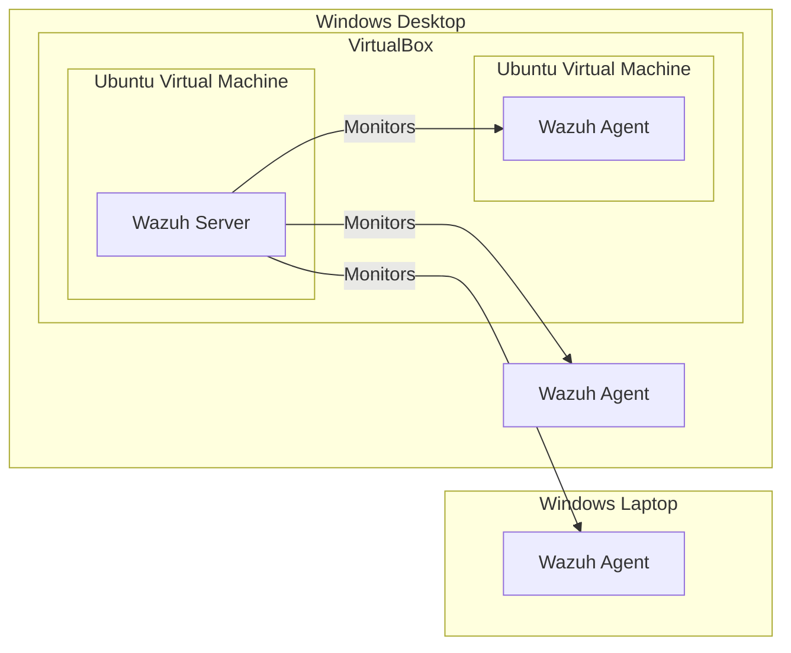

Visibility. That's the problem.

Security Information and Event Management, or SIEM, is a comprehensive system that provides real-time analysis of security alerts. This is an essential tool for security operation centers (SOC), whereby data generated by endpoints can be collected, aggregated, and analyzed. In this post, we will talk about <a href="https://wazuh.com/">Wazuh</a> and my experiences in installing it.

Why Wazuh? Primarily, it's open-source. Second, the ease of installation. Lastly, the name has a cool ring to it—sounds like something you'll hear on a kids movie.

    

        
    

    Mike "Wazuh"wski

Now that's visibility! Just like how Wazuh is able to see endpoint alerts, plus the user can see into its <a href="https://github.com/wazuh/wazuh">code</a>.

Before we dive deeper into Wazuh, let's first discuss *what* to protect. We have already talked about what a SIEM is and why companies should have it on their SOC, but it is important to know how many devices (or assets) we have, and which ones to secure. In reality, most organizations have a lot of computers, some of which may have different operating systems and configurations. It is possible that SIEM agents may not be compatible with some of the workstations. In addition, some SIEMs may charge fees for exceeding a certain amount of endpoints, or even on a per-endpoint basis. This increases total cost of ownership. BUT, there's Wazuh! With its open-source to security, Wazuh is available at no cost! Huzzah!

For testing, we will be securing four machines: one desktop, one laptop, and two virtual machines. The physical machines run on Windows 10, and the virtual machines run on **Ubuntu 20.04** via VirtualBox. The Wazuh server will be deployed on one of the Ubuntu VMs, whereas the other machines will have Wazuh agents.

The first thing to set up is the Wazuh server on our Ubuntu 20.04 VM. Assume that all commands here are run as root user. Since it will be running on a fresh install on Ubuntu 20.04, we need to update the packages to minimize bugs and dependency errors. This can be done by running `apt update` followed by `apt full-upgrade`. We need to install **curl** as well, by running `apt install curl`. We should be able to install Wazuh without much fuss.

Wazuh has three central components: <a href="https://documentation.wazuh.com/current/installation-guide/wazuh-indexer/index.html">Wazuh indexer</a>, <a href="https://documentation.wazuh.com/current/installation-guide/wazuh-server/index.html">Wazuh server</a>, and <a href="https://documentation.wazuh.com/current/installation-guide/wazuh-dashboard/index.html">Wazuh dashboard</a>. These components will be installed, in order, on our Ubuntu 20.04 VM. Thankfully, the installation guides are straightforward. I was able to install these components without devolving into insanity. Seriously, it all took around 2 hours, with most slow downs due to Internet connection and occasional stuck processes.

Now that the Wazuh server is up and running, next is to set a **static IP** address for the VM. When Wazuh agents are deployed, they will be connecting to the IP address of the Wazuh server. Therefore, dynamic IP address assignment via DHCP is not ideal. Under VirtualBox, I set the network adapter to bridged for the VM and took note of its MAC address. Next, I configured the DHCP settings on my router to set a static IP address on the MAC address of the VM. In this case, I used 192.168.1.125.

Opening 192.168.1.125 will bring up the Wazuh login screen. Once logged in, we can now deploy our <a hred="https://documentation.wazuh.com/current/installation-guide/wazuh-agent/index.html">Wazuh agents</a>. From here, the setup will be GUI-based, where the requisite commands will be generated by the web interface. I just need to select the OS, enter the Wazuh server IP address and Wazuh agent name. I copied the commands and ran it on the endpoints. After initializing the Wazuh agent, I was able to see it on the Wazuh server.

At this point, we have finished installing Wazuh. All that's left is to explore its features, on which there are many. Expanding the hamburger, we get the following menus:

    

        
    

    

        
    

    

        
    

Lots to see and lots to click, but I got tired of reading documentation. So I searched for a guide on Youtube on setting a dashboard, and it lead me to MyDFIR's <a href="https://www.youtube.com/watch?v=QrcAhd5P7xw">tutorial</a> on creating a custom dashboard. I noticed that in his guide, he used the description "data.virustotal" on one of his visualizations. Essentially, he created data table of the top 5 alerts related to **VirusTotal**. I looked into it, and realized the power of Wazuh. It has the ability of becoming an eXtended Detection and Response (XDR). By adding the necessary scripts, Wazuh can handle File Integrity Monitoring and automatically remove malicious files on the endpoints. It's like running an antivirus software on the machine. This is something I need to try, but wow. Wazuh, you're awesome!

That concludes my experiences with Wazuh. Overall, I'm quite pleased and can't wait to try out its other features. You'll be hearing more about this tool on this blog.

If you'd like to learn more, I suggest you watch John Hammond's <a href="https://www.youtube.com/watch?v=7Gn1GY5CIxg">video</a> about Wazuh.