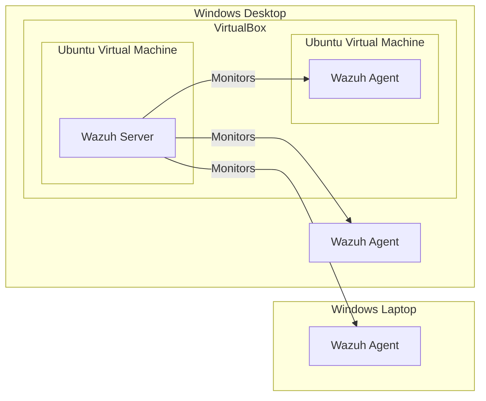

In my <a href="/wazuh-install">previous</a> blog post, I alluded to Wazuh being both a SIEM and an XDR. I specifically mentioned that VirusTotal can be integrated into Wazuh for file integrity monitoring. Today, we'll be discussing how I enabled VirusTotal integration in Wazuh.

    

        
    

But what's <a href="https://www.virustotal.com/">VirusTotal</a>? It is a free online service that analyzes files, URLs, IP addresses, and domains for malware. VirusTotal works with antivirus scanners and URL/domain blocklisting services to intelligently inspect anything you upload to its web interface. In addition, when a user scans an object, the results are aggregated in a global repository, thereby making a contribution to worldwide cybersecurity efforts. This is an extremely useful tool for any cybersecurity professional!

Now that you know how important VirusTotal is, let's get to configuring it! But let us recall first our infrastructure:

As you can see, we have two physical machines running Windows, and two Ubuntu virtual machines. Our Wazuh server is installed in one of the Ubuntu VMs, while the rest have Wazuh agents (a.k.a. endpoints).

I followed Wazuh's <a href="https://documentation.wazuh.com/current/proof-of-concept-guide/detect-remove-malware-virustotal.html">Proof of Concept guide</a> for detecting and removing malware using VirusTotal integration. In this guide, three files will be referenced multiple times:
- ossec.conf
- local_rules.xml
- remove-threat.sh / remove-threat.exe

Depending on the operating system, the `ossec.conf` file can be found in `C:\Program Files (x86)\ossec-agent\` for Windows; and under Ubuntu it can be found in `/var/ossec/etc/`. We will be modifying the configuration file for both the Wazuh server and the Wazuh agents. Whereas the  `local_rules.xml` will be modified on the Wazuh server only, which can be found in `/var/ossec/etc/rules` directory. Lastly, the `remove-threat` file is the active response script provided by Wazuh, so we don't need to write it ourselves. We are free to modify the script to fit our environment, but for this home lab, it works out of the box.

    

        
    

    

        
    

    

        
    

We must also be familiar with the software we will be using, primarily, the use terminal and Powershell commands. I exclusively used the command-line interface to set up the VirusTotal integration, except for in Windows where I had to open Notepad to edit text files and and install Python using the installer GUI.

After becoming familiar with the files and tools needed, we can proceed to follow the guide. I first set up the endpoints, both Ubuntu and Windows. Afterwards, I configured the Wazuh server on the Ubuntu VM. Then, I downloaded an EICAR file on both agents. What's an EICAR file you ask? An EICAR file is used to test the detection capability of an antivirus software. Once I downloaded the EICAR files, hits began showing up on the dashboard.

    

        
    

As you can see, Wazuh was able to detect that the EICAR file was added on the endpoint. That's when VirusTotal kicks in. Wazuh integrates VirusTotal for File Integrity Monitoring (FIM), meaning, the EICAR file will be sent to VirusTotal for scanning. A VirusTotal alert gets outputted, therefore flagging the file as malicious.

The title of this blog post is "I downloaded malware! Now what?" The answer is: Wazuh **deletes** the malicious file. Automatically! Without user intervention! That's the beauty of active response. With a SIEM like Wazuh, we can integrate detection and response functionalities, allowing seamless removal of files on the endpoints while flagging an alert in the server. This is why Wazuh is both a SIEM and an XDR.

With that, we have successfully configured VirusTotal, simulated an attack, and visualized an alert in Wazuh. This splendid software has more to offer though, so we might be seeing each other again soon.

Until next time!